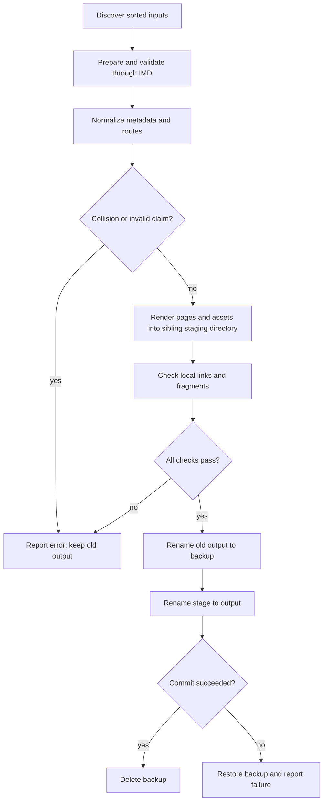
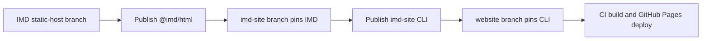

# IMD Static Website - Plan

## Goal Capsule

- **Objective:** Authors can publish ordinary Markdown and interactive IMD documents at `rmontalti.com` as a fast, portable static website while keeping all current public URLs stable.
- **Means:** Replace SWP with a small standalone `imd-site` generator, add a static-host API to IMD, and migrate the website through pinned package releases (KTD1, KTD2, KTD11).
- **Authority:** Product behavior is owned by R1-R17. Technical mechanisms are owned by KTD1-KTD16. Implementation units may add local detail but may not override either contract.
- **Execution profile:** Three repositories on separate feature branches: `rhighs-lab/imd`, a new `~/repos/imd-site`, and `rhighs/website`. `rhighs/swp` is a read-only reference.
- **Stop conditions:** Stop before release or migration if the IMD host package is not self-contained, route and anchor parity is not proven, a page requires JavaScript for its readable content, or the transactional output commit cannot restore the last good build.
- **Tail ownership:** The website repository owns the deployed artifact and URL compatibility. The generator owns site assembly. IMD owns document semantics and interactive behavior.

---

## Product Contract

### Summary

Build a small static-site generator named `imd-site` in its own repository under `~/repos`.
It turns a directory of `.md` and `.imd` content into a deterministic directory of complete HTML pages and shared assets.
IMD supplies parsing, validation, rendering, pack resolution, server markup, and browser hydration.
The generator supplies routing, metadata rules, layouts, navigation, copied files, feeds, sitemaps, and transactional build output.
The website migrates to this tool without changing its existing page URLs.

### Problem Frame

SWP proves the right mental model, but its 121-line shell pipeline has no stable metadata model, collision detection, reusable renderer API, feeds, sitemaps, or shared interactive asset planner.
The current IMD CLI can render a standalone viewer page, but that page starts with an empty root and mounts a React application in the browser.
Its viewer build also depends on monorepo paths and does not provide a self-contained package that another repository can consume.
Neither repository currently owns the missing static-site concerns.

The current website also contains migration constraints that cannot be ignored.
GitHub Pages deploys the checked-in `web.static` directory without building it.
Some Markdown uses raw HTML that IMD intentionally does not render.
One media asset uses Git LFS, and the deployment checkout does not request LFS objects.
Pandoc and IMD also generate at least one different heading identifier, so preserving only page filenames would still break deep links.

### Requirements

**Document format and rendering**

- R1. A build converts one configured content directory into one deterministic static output directory and requires no application server at run time.
- R2. Both `.md` and `.imd` documents use the same IMD parse, validation, and rendering pipeline, so Markdown without IMD directives remains valid content.
- R3. Every page contains readable server-rendered HTML, plain pages load no IMD JavaScript, and interactive pages hydrate only the IMD document root.
- R4. Site configuration selects packs from the trusted built-in catalog, document `uses` entries only resolve against that registry, and missing or incompatible versions fail the build.
- R5. Each runtime or pack artifact group is emitted once at a content-addressed path, and each page references only its required groups and their declared transitive dependencies.

**Routes, presentation, and publishing data**

- R6. Default routes map `index.md` or `index.imd` to `index.html` and any other document to its sibling `.html` path; a valid `permalink` may override that route.
- R7. The generator normalizes `title`, `description`, `date`, `updated`, `draft`, `permalink`, `layout`, `nav`, and `feed` from IMD's generic frontmatter metadata without adding site policy to the IMD parser.
- R8. Trusted layouts receive page content, site data, and a deterministic page tree; navigation and generated directory indexes sort by `nav.order`, then title, then route.
- R9. The build copies configured static files and non-document content assets, emits `rss.xml` and `sitemap.xml` when configured, and never derives published dates from filesystem timestamps.
- R10. The build validates every route, asset target, local link, and local fragment before a transactional output commit that restores the previous directory if commit fails.

**CLI, packaging, and portability**

- R11. The useful CLI consists of `imd-site build` and `imd-site dev`, with configuration in one JavaScript module and validation included in both commands.
- R12. A versioned, self-contained IMD static-host package is the only IMD integration boundary used by the generator, and the website consumes stable registry releases through a frozen lockfile.
- R13. Generated links are relative to their page and remain valid on a custom domain, GitHub Pages, a local file server, or the normalized configured `site.basePath`.

**Migration and deployment**

- R14. The migration preserves all nine current HTML routes, copied asset routes, existing heading identifiers, and valid internal fragments before any Markdown file is renamed to `.imd`.
- R15. Raw HTML in current Markdown is replaced with supported Markdown or IMD constructs; the migration does not enable unsafe HTML parsing to preserve old markup.
- R16. The website build fetches Git LFS content, generates `web.static` in CI, includes `CNAME`, and deploys only a successfully generated artifact.
- R17. Work is isolated on one feature branch per changed repository, and the new generator repository is created at `~/repos/imd-site`.

### Success Criteria

- Two clean builds from identical inputs produce byte-identical files and identical file ordering in generated manifests and XML.
- All nine current page URLs and the recorded heading fragments remain present after migration.
- A plain Markdown page is fully readable with JavaScript disabled and contains no IMD runtime script.
- A representative interactive page is readable before JavaScript, then hydrates and enables its controls without replacing the site shell.
- Each required artifact group exists once in the output, unrelated groups keep stable URLs when site content changes, and unrelated pages do not load them.
- A route collision, missing pack, invalid local fragment, render error, or simulated commit failure leaves or restores the prior output.
- The GitHub Pages workflow builds from source and publishes the custom domain plus the real LFS media object.

### Actors

- A1. **Content author:** writes Markdown or IMD, chooses metadata, references local assets, and runs the build or development server.
- A2. **Reader:** loads plain or interactive static pages, possibly with JavaScript unavailable or delayed.
- A3. **Deployment pipeline:** installs pinned packages, builds the entire site, and uploads the generated directory to GitHub Pages.

### Key Flows

- F1. Author and build
  - **Trigger:** A1 adds or edits a document, layout, pack configuration, or static asset.
  - **Actors:** A1
  - **Steps:** Discover inputs, prepare and validate each document through IMD, normalize site metadata, preflight routes and assets, render into a staging directory, verify links and fragments, then commit output with a recoverable rename sequence.
  - **Outcome:** A complete deterministic site exists, or the last good site remains available or restored.
  - **Covered by:** R1, R2, R4, R6-R11
- F2. Plain page read
  - **Trigger:** A2 requests a page that has no interactive pack requirement.
  - **Actors:** A2
  - **Steps:** The browser receives the site shell and document HTML, loads the site stylesheet, and does not request the IMD browser runtime.
  - **Outcome:** The page is complete and readable without JavaScript.
  - **Covered by:** R3, R5, R13
- F3. Interactive page read
  - **Trigger:** A2 requests a page with one or more trusted interactive packs.
  - **Actors:** A2
  - **Steps:** The browser displays server-rendered initial content, loads the page's shared runtime and pack artifact groups, hydrates only the document root, then enables controls.
  - **Outcome:** The page remains readable during loading and becomes interactive without turning the website into an SPA.
  - **Covered by:** R3-R5
- F4. Incremental migration
  - **Trigger:** A1 moves one existing page from Pandoc-era Markdown to the IMD pipeline or renames it from `.md` to `.imd`.
  - **Actors:** A1, A3
  - **Steps:** The compatibility fixtures compare routes and fragments, the content is cleaned of unsupported raw HTML, and the normal build runs.
  - **Outcome:** The content format changes without changing the public URL.
  - **Covered by:** R2, R14-R16

### Acceptance Examples

- AE1. **Covers R2, R6, R10.** Given `posts/example.md` and `posts/example.imd`, when a build starts, then it reports a same-route collision before writing output.
- AE2. **Covers R3, R5.** Given a Markdown page with no `uses`, when it builds, then its HTML has rendered prose and no runtime script or pack script.
- AE3. **Covers R3-R5.** Given two nested IMD pages that use the same pack, when they build, then both resolve one shared asset copy through correct relative URLs.
- AE4. **Covers R4.** Given a document that declares an unconfigured pack, when it builds, then the error names the document, pack, and requested version and the old output remains intact.
- AE5. **Covers R7, R9.** Given a draft page, when it builds for production, then no page, navigation entry, RSS item, or sitemap URL is emitted for it.
- AE6. **Covers R10.** Given a page with `#missing-fragment`, when the target page lacks that identifier, then the build fails before output replacement.
- AE7. **Covers R14.** Given `web/posts/quadtrees.md`, when it is renamed to `.imd`, then `/posts/quadtrees.html` and every recorded legacy heading fragment remain unchanged.
- AE8. **Covers R15.** Given a raw HTML block in a source document, when the site policy checks it, then the build fails with a migration diagnostic instead of silently dropping the block.
- AE9. **Covers R16.** Given the Git LFS video referenced by the site, when CI builds, then the deployed file is the media object and not an LFS pointer.
- AE10. **Covers R4.** Given a document that requests an available pack at an unsatisfied version, when it builds, then version resolution is fatal rather than a warning.
- AE11. **Covers R10.** Given a verified stage and an injected failure while renaming the stage to output, when the commit runs, then the backup is restored and stale stage data is reported for cleanup.

### Scope Boundaries

**Included**

- A public, self-contained IMD API for static markup, hydration data, registry checks, and reusable browser assets.
- A standalone Node.js static-site generator with two commands and one configuration file.
- A trusted JavaScript layout contract, deterministic navigation, automatic indexes, assets, RSS, sitemap, and recoverable transactional output.
- The current website migration, URL and fragment compatibility tests, and GitHub Pages build deployment.

**Deferred**

- A general third-party pack installer, remote pack marketplace, arbitrary package discovery, and public external adapter API remain follow-up work under IMD issue [#11](https://github.com/rhighs-lab/imd/issues/11).
- A first-class video pack is optional follow-up work; the current video can migrate to a poster and file link.
- Renaming `web` to `content` or `web.static` to `dist` is deferred until after compatibility cutover.

**Excluded**

- A CMS, database, server-rendered application service, generic React SPA, visual page editor, authentication system, or deployment control plane.
- Rewriting SWP or keeping Pandoc as a permanent second renderer.
- A general-purpose theme ecosystem or new template language.

### Dependencies and Risks

| Risk or dependency | Impact | Mitigation |
|---|---|---|
| The current IMD viewer is browser-mounted and monorepo-coupled | A standalone generator cannot produce portable static pages from published packages | U1 and U2 create and publish a self-contained `@imd/html` boundary before the generator is released |
| Built-in packs may access browser-only APIs during server rendering | Interactive pages could fail to build or produce mismatched hydration | Add an SSR conformance suite for every built-in pack and require meaningful static fallbacks plus disabled controls until hydration commits |
| Runtime, Mermaid, and highlighting bundles are large | Loading the union on every page would violate the lightweight goal | Address each prebuilt artifact group by its own bytes, declare transitive groups, and omit browser highlighting from ordinary code pages |
| Raw HTML is present in current content | IMD would drop parts of published pages | Make raw HTML a site build error and migrate each occurrence explicitly |
| Pandoc and IMD slug rules differ | Existing deep links can break despite stable page routes | Record published IDs and pass explicit route-scoped `headingIdOverrides` through the IMD host API |
| The video is stored through Git LFS | CI can deploy a pointer or wrong object instead of the video | Enable LFS checkout and verify the expected size and SHA-256 before upload |
| Three repositories must release in order | Moving git references can make builds non-reproducible | Publish stable IMD first, publish stable generator second, then repeat the clean website build against registry releases and a frozen lockfile |
| GitHub Pages has one production destination | There is no safe deployment preview slot for the custom domain | Browser-test the exact CI artifact before upload, smoke-test production after deploy, and retain a one-commit website revert path |

### Sources

- SWP baseline: [`rhighs/swp`](https://github.com/rhighs/swp) at `7fc927a61900`; the `swp` script supplies the directory-copy and sibling-HTML precedent.
- IMD baseline: `rhighs-lab/imd` at `d1c65ea0f24c`; see `docs/SPEC.md`, `packages/core/src/parser`, `packages/core/src/validator`, `packages/react/src`, `packages/cli/src/render`, and `apps/playground/src/viewer`.
- Website baseline: `rhighs/website` at `20e5c21a2f10`; see `swp.conf`, `web`, `web.static`, `.gitattributes`, and `.github/workflows/deploy.yml`.
- Pack distribution direction: IMD issue [#11, Add installable external extensions](https://github.com/rhighs-lab/imd/issues/11).

---

## Planning Contract

### Key Technical Decisions

- KTD1. **Replace SWP with a standalone generator.** SWP remains design inspiration because extending its shell pipeline would put metadata, pack graphs, and transactional output into the wrong abstraction.
- KTD2. **Keep a three-layer boundary.** IMD owns document meaning and interactive execution, `imd-site` owns website assembly, and the website repository owns content, presentation, and deployment.
- KTD3. **Use IMD for Markdown and IMD files.** A no-directive Markdown document is valid IMD, so one pipeline avoids permanent Pandoc compatibility drift.
- KTD4. **Render static HTML first and hydrate a document island.** The server API returns readable markup and disabled interactive controls; the browser runtime uses hydration on only the marked IMD root and never owns navigation or the page shell.
- KTD5. **Resolve only configured built-in packs in v1.** `@imd/html` ships a trusted catalog of server factories and matching prebuilt browser groups, while frontmatter `uses` selects configured catalog names and never triggers installation or dynamic import.
- KTD6. **Make routes predictable and strict.** File routes follow R6; permalinks must be root-relative `.html` paths with no query, fragment, `..`, case-folded collision, or reserved output target.
- KTD7. **Use trusted ESM layout functions.** A layout module receives immutable site, page, navigation, rendered content, and asset URL data; this supports loops and conditionals without inventing a template language.
- KTD8. **Build navigation from the published page tree.** The default view exposes parent, siblings, and children; `nav.hidden` removes an entry, and ordering uses `nav.order`, then title, then route.
- KTD9. **Address each browser artifact group by its own content.** Emit runtime and pack groups under `_imd/<group>/<sha256>/`, preserve companion relative files, and declare transitive group dependencies so unrelated changes do not invalidate caches.
- KTD10. **Use a preflight, staging, backup, and commit build.** Build and verify a sibling stage, rename existing output to a sibling backup, rename the stage to output, restore the backup on second-rename failure, and delete the backup only after success.
- KTD11. **Publish a bundled, self-contained `@imd/html` package.** The v1 tarball includes the internal server dependency closure, built-in pack factories, declarations, and prebuilt browser groups because the current internal packages are private and use `workspace:*`.
- KTD12. **Preserve compatibility with fixtures, not a dual renderer.** Snapshot current routes, heading IDs, and internal fragments once, then make the IMD output satisfy that inventory while Pandoc is removed.
- KTD13. **Release through isolated branches in dependency order.** Use `feat/static-host-api` in IMD, `feat/initial-generator` in `~/repos/imd-site`, and `feat/imd-site-migration` in the website; release and pin each upstream before the next repository consumes it.
- KTD14. **Prepare each document before site metadata and route work.** IMD is the frontmatter reader, so the content graph stores one prepared handle before the generator normalizes `draft`, `permalink`, title, and other site keys.
- KTD15. **Resolve source URLs through the IMD host boundary.** IMD returns source-located link and image references and renders with the generator's resolved URL map so server markup and the first hydration render use identical URLs after permalink changes.
- KTD16. **Preserve headings with explicit host overrides.** The compatibility fixture maps a route and IMD-generated heading ID to the published legacy ID; IMD applies that override to both the outline and rendered heading, with no second slug algorithm or hidden alias.

### High-Level Technical Design

The generator is the coordinator, not a second document runtime.
It asks IMD to prepare and render each document, then places that result into a site layout.
It never inspects IMD directive syntax or implements pack behavior.

```mermaid
flowchart TB
  C[Content directory: md, imd, local assets] --> H[@imd/html prepare and validate]
  SC[Site config and built-in pack selection] --> H
  H --> G[imd-site metadata, routes, URL map, and content graph]
  G --> M[@imd/html static markup and safe hydration payload]
  H --> P[Prebuilt runtime and pack group requirements]
  M --> L[Trusted site layout]
  G --> L
  L --> O[Complete static HTML pages]
  P --> A[Content-addressed _imd artifact groups]
  G --> X[Copied assets, indexes, RSS, sitemap, CNAME]
  O --> D[Staged output directory]
  A --> D
  X --> D
```

The build has one commit point.
All route and asset owners are known before any final output changes.
The existing output remains deployable if any stage fails.



Readers get two static-first paths.
Interactive controls remain disabled until their exact artifact groups are ready, but the initial information stays visible.

```mermaid
stateDiagram-v2
  [*] --> StaticHTML
  StaticHTML --> Complete: no interactive requirements
  StaticHTML --> StaticFallback: interactive requirements present; controls disabled
  StaticFallback --> Hydrating: required groups load
  Hydrating --> Interactive: hydration succeeds
  Hydrating --> ReadableFallback: load or hydration fails
  ReadableFallback --> [*]
  Interactive --> [*]
  Complete --> [*]
```



The release boundary is also explicit.
Each downstream repository consumes only a published and pinned upstream version.



### API Contracts

`@imd/html` exposes a small server and asset surface instead of the current whole-page CLI renderer.
The exact names may follow existing IMD conventions, but these responsibilities are stable:

- **Prepare:** Parse once, validate, resolve exact built-in pack versions, apply heading ID overrides, and return generic metadata plus a reusable prepared handle.
- **References:** Return source-located link and image references with raw URL, kind, and source span so the host can create one URL map.
- **Render:** Accept the URL map and return static HTML, root attributes, a safely serialized hydration payload, and required artifact-group fingerprints.
- **Hydrate:** Hydrate existing markup with the same prepared source, initial store state, heading IDs, resolved URLs, and pack fingerprints; never remount an empty root.
- **Assets:** Expose immutable prebuilt group descriptors with identity, version, server factory, browser files, CSS, dependencies, and file digests.

Safe payload serialization must escape `<` and Unicode line separators.
On asset load, version, or hydration mismatch, the server fallback remains visible and controls remain disabled.
The package exports its browser entry, scoped stylesheet, built-in catalog, and public declarations through declared package exports.

The `imd-site` configuration surface should stay close to this shape:

```js
export default {
  content: "web",
  output: "web.static",
  static: "static",
  layouts: "layouts",
  site: {
    title: "Roberto Montalti",
    url: "https://rmontalti.com",
    basePath: "/",
    language: "en"
  },
  packs: ["@imd/charts", "@imd/graph"]
};
```

Documents keep arbitrary IMD metadata.
The generator reads only the R7 site keys.
Title resolution uses frontmatter `title`, then the first heading, then the filename stem.
Dates must be explicit ISO 8601 strings.
Drafts produce no page or derived publication data in production mode.

Layouts live in `layouts/<name>.mjs` and default to `default.mjs`.
The generator owns the doctype, metadata tags, canonical URL, feed link, style links, hydration data, and script ordering.
The layout function returns the trusted body shell and places the supplied rendered content once.
It receives an escaping helper for site-authored strings and a distinct trusted fragment for IMD markup.

### Route, Asset, Feed, and Index Rules

- Reserve `_imd/`, `rss.xml`, `sitemap.xml`, and generator-owned manifest names before content claims routes.
- Compare output claims after path normalization and case folding even on case-sensitive development filesystems.
- Generate a directory index only when that directory has published children and no explicit `index.md` or `index.imd`.
- Copy non-document files found under the content directory to the equivalent public path.
- Copy the configured static directory to the output root, with any collision treated as a build error.
- Resolve each document-relative URL against the source document, then pass the page-relative public URL map to both server rendering and hydration.
- Build each artifact-group hash from its stable manifest and file bytes, never a clock, temporary path, site-wide union, or package installation path.
- Include every published non-draft canonical page in `sitemap.xml`, sorted by canonical URL; use only explicit `updated` or `date` as `lastmod`.
- Include only pages with `feed: true` in `rss.xml`; require `title`, `date`, and `description`, and publish the description plus canonical link instead of interactive body HTML.

### Output Structure

**IMD repository (`rhighs-lab/imd`)**

```text
packages/html/
  package.json
  tsconfig.json
  src/
    index.ts
    server.tsx
    client.tsx
    assets.ts
    styles.css
  test/
    server/
      static-render.test.tsx
      pack-ssr.test.tsx
    client/
      hydration.test.tsx
```

Existing viewer asset planning moves behind this package.
The CLI and playground become consumers instead of private owners of reusable build code.

**Generator repository (`~/repos/imd-site`)**

```text
package.json
pnpm-lock.yaml
tsconfig.json
src/
  bin/imd-site.ts
  cli.ts
  config.ts
  content.ts
  metadata.ts
  routes.ts
  navigation.ts
  layouts.ts
  assets.ts
  feed.ts
  sitemap.ts
  links.ts
  output.ts
  build.ts
  dev.ts
test/
  fixtures/
  build.test.ts
  routes.test.ts
  hydration.test.ts
  browser/
    plain.spec.ts
    interactive.spec.ts
examples/minimal/
playwright.config.ts
README.md
```

**Website repository (`rhighs/website`)**

```text
web/                         # existing content root retained during migration
layouts/default.mjs
static/style.css
static/CNAME
imd-site.config.mjs
package.json
pnpm-lock.yaml
test/fixtures/legacy-urls.json
```

`web.static` becomes generated output and is removed from version control after the migration branch proves parity.

### Implementation Constraints

- Use Node.js 22 and pnpm to match IMD's current runtime and package manager.
- Use package exports rather than imports from `dist` or repository-private paths.
- Keep IMD runtime CSS scoped under the document root; do not style `html`, `body`, or the site shell.
- Do not serialize build machine paths, timestamps, random IDs, or dependency installation paths into output.
- Do not use browser Shiki or Mermaid assets on pages that do not require them.
- Do not invoke Vite or another pack compiler during a site build; copy verified prebuilt artifact groups from `@imd/html`.
- Do not interpret raw HTML in the site generator.
- Do not write into the final output until the staged build passes every check.
- Reject output paths that equal or contain the content, layout, static, or repository roots, including equivalent symlink targets.
- Mark the document root busy if needed, but do not make readable fallback content inert to assistive technology; disable interactive controls individually until hydration commits.
- Preserve user changes in each worktree and create the new repository only under `~/repos/imd-site`.

### System-Wide Impact

- **IMD monorepo:** The playground and CLI lose ownership of reusable viewer construction and become consumers of `@imd/html`. Root TypeScript references, Vitest projects, package build order, and release tooling must include the new package.
- **Package boundary:** `@imd/html` is intentionally bundled because the current dependency closure is private. A declaration leak or workspace reference is a release blocker, not a consumer workaround.
- **Hydration identity:** Source, initial state, pack fingerprints, heading overrides, and resolved URLs must match across server and browser. Safe serialized payloads are data, never executable site configuration.
- **Cache lifecycle:** Artifact groups change URLs only when their own files or declared dependency manifest changes. Adding an unrelated page or pack must not evict cached runtime groups.
- **Output lifecycle:** Stages and backups are sibling directories with generator-owned markers. Recovery never deletes an unmarked path, and output-path safety is resolved before any staging work.
- **Deployment lifecycle:** `build-and-verify` owns the artifact and inventory. `deploy` only publishes that artifact. The website owner makes the final go or no-go decision and owns the live rollback.

### Rollout and Rollback

- The IMD owner records the stable `@imd/html` version and registry tarball integrity after U2.
- The generator owner records the stable CLI version and its clean external-consumer result after U5.
- The website owner records the lockfile hash, legacy compatibility report, expected LFS size and hash, and production artifact inventory before U7 deploys.
- A build or upload failure performs no live action; GitHub Pages continues to serve the previous deployment.
- A live smoke failure triggers a revert of the single website cutover commit. That revert restores the previous workflow and committed `web.static` from the recorded pre-cutover commit.
- Upstream package releases are immutable and remain published during a website rollback, but the reverted website does not consume them.

### Sequencing

1. Create the IMD feature branch and implement U1 and U2.
2. Publish a prerelease package and prove it can be consumed without the IMD repository present.
3. Publish stable `@imd/html` and record its registry integrity.
4. Create `~/repos/imd-site` on its own feature branch and implement U3-U5 against the stable IMD package.
5. Publish a generator prerelease and prove that its packed CLI works without the IMD repository present.
6. Publish stable `imd-site` and record its registry integrity.
7. Implement U6 against both stable packages and compare the generated website with compatibility fixtures.
8. Update the website lockfile, repeat the cross-repository smoke build from clean checkouts, implement U7, and cut over deployment.

---

## Implementation Units

### U1. Add the IMD static-host rendering API

- **Goal:** Make IMD capable of producing validated static markup and a hydration contract without owning a website shell.
- **Requirements:** R2-R4, R12, R15
- **Repository:** `rhighs-lab/imd`
- **Dependencies:** None
- **Files:** `packages/html/package.json`, `packages/html/tsconfig.json`, `packages/html/src/index.ts`, `packages/html/src/server.tsx`, `packages/html/src/client.tsx`, `packages/html/src/styles.css`, `packages/html/test/server/static-render.test.tsx`, `packages/html/test/server/pack-ssr.test.tsx`, `packages/html/test/client/hydration.test.tsx`, `packages/react/src`, `packages/core/src/validator`, `packages/core/src/images`, a new core link-reference module, `tsconfig.json`, `tsconfig.tests.json`, `vitest.config.ts`
- **Approach:** Add `@imd/html` as the public host boundary described by KTD4, KTD11, KTD15, and KTD16. Reuse `parse`, `validate`, the registry, outline generation, and React renderers. Prepare once and return metadata, diagnostics, source-located link and image references, static markup, scoped root attributes, safe hydration data, and artifact requirements. Add host-provided URL and heading ID maps to both server and browser rendering. Make raw HTML detectable so a host can reject it with a source location while the core rendering policy stays safe. Give every built-in block meaningful static content and keep controls disabled through the first hydration render.
- **Test Scenarios:** Plain Markdown renders without hydration data; invalid IMD returns diagnostics before markup is accepted; unknown and version-incompatible packs fail registry resolution; every built-in pack server-renders meaningful content in Node; Mermaid exposes readable source or a semantic fallback before JavaScript; browser hydration uses existing markup with no recoverable mismatch, leaves the surrounding shell unchanged, preserves resolved URLs and heading IDs, then enables controls; failed hydration keeps the fallback; runtime styles do not target global page elements.
- **Verification:** Run `pnpm typecheck`, targeted Vitest tests for `packages/html`, then `pnpm test` and `pnpm lint` from the IMD repository.

### U2. Package reusable IMD browser assets

- **Goal:** Ship the runtime and pack asset planner as a self-contained versioned package surface.
- **Requirements:** R4, R5, R12
- **Repository:** `rhighs-lab/imd`
- **Dependencies:** U1
- **Files:** `packages/html/src/assets.ts`, `packages/html/package.json`, `packages/cli/src/render/bundles.ts`, `packages/cli/src/render/page.ts`, `packages/cli/package.json`, `packages/cli/tsconfig.json`, `packages/cli/test/bundles.test.ts`, `packages/cli/test/render.test.ts`, `packages/cli/test/render-e2e.test.ts`, `apps/playground/src/viewer`, `apps/playground/vite.viewer.config.ts`, `apps/playground/package.json`, `apps/playground/test/viewer-boot.test.ts`, `apps/playground/test/viewer-bootstrap.test.ts`, `apps/playground/test/viewer-output.test.ts`, root build, test, prepack, and release configuration
- **Approach:** Move the reusable browser host, features, shims, styles, and artifact planner out of the playground. Bundle the private server dependency closure and built-in pack factories into `@imd/html`, and ship prebuilt browser groups in the tarball under KTD5 and KTD11. Add package exports, `files`, declarations, and a prepack build. Leave the playground and CLI as thin consumers. Preserve font and worker relative paths, and leave external pack installation and package discovery to issue #11.
- **Test Scenarios:** A packed tarball works in a temporary consumer with the IMD checkout unavailable; public declarations expose no private `@imd/*` or `workspace:*` dependency; two documents that share a pack produce one group; an unrelated pack does not change an existing group URL; a prose, code, or math-only document produces no runtime JavaScript, while math may emit CSS; package output does not mention `apps/playground` or workspace locations; every manifest, dependency edge, and file hash is stable across repeated package builds.
- **Verification:** Run the IMD full checks, `pnpm pack` for `@imd/html`, install the tarball into a temporary fixture, and build one plain and one interactive document from that fixture.

### U3. Build the standalone generator core

- **Goal:** Create the smallest useful content graph, configuration, route, metadata, navigation, and layout engine in `~/repos/imd-site`.
- **Requirements:** R1-R4, R6-R8, R11-R13, R17
- **Repository:** `~/repos/imd-site`
- **Dependencies:** U2
- **Files:** `package.json`, `pnpm-lock.yaml`, `tsconfig.json`, `src/bin/imd-site.ts`, `src/cli.ts`, `src/config.ts`, `src/content.ts`, `src/metadata.ts`, `src/routes.ts`, `src/navigation.ts`, `src/layouts.ts`, `test/routes.test.ts`, `test/fixtures`
- **Approach:** Initialize a TypeScript ESM package with Node.js 22 and a pinned stable `@imd/html` dependency. Load one `imd-site.config.mjs`, discover inputs in lexical order, prepare each document once under KTD14, normalize R7 metadata, claim routes under KTD6, create the published page tree, resolve source URLs under KTD15, and load trusted layouts under KTD7. Treat same-stem Markdown and IMD, case-folded paths, automatic indexes, and reserved paths as one route collision domain; U4 adds copied-file claims when those inventories are available.
- **Test Scenarios:** Default and permalink routes resolve correctly; invalid or escaping permalinks fail; `.md` and `.imd` same-stem collisions fail; draft pages disappear from the page tree; title fallback is stable; navigation sorting follows KTD8; an explicit directory index suppresses the generated index; `site.basePath` normalizes once; route-scoped heading overrides change both outline and markup; a layout cannot omit the document content without a diagnostic.
- **Verification:** Run the repository's `pnpm typecheck`, `pnpm test`, and `pnpm lint`; run the packed CLI against the minimal example from outside the repository.

### U4. Add deterministic and transactional site output

- **Goal:** Turn the content graph into a complete static directory with shared assets and a single safe commit point.
- **Requirements:** R1-R5, R9, R10, R13
- **Repository:** `~/repos/imd-site`
- **Dependencies:** U3
- **Files:** `src/build.ts`, `src/assets.ts`, `src/feed.ts`, `src/sitemap.ts`, `src/links.ts`, `src/output.ts`, `test/build.test.ts`, `test/hydration.test.ts`, `test/fixtures`, `test/browser/plain.spec.ts`, `test/browser/interactive.spec.ts`, `playwright.config.ts`
- **Approach:** Render the prepared handles from U3 into a sibling staging directory. Copy content and static files, merge their claims into the collision domain, generate feeds and indexes, copy only required prebuilt artifact groups under KTD9, then parse final HTML and XML to verify staged links and fragments. Commit with the KTD10 backup and restore protocol. Clean stale stage and backup directories only after identifying them as generator-owned.
- **Test Scenarios:** Repeated builds are byte-identical; nested pages and a non-root base path resolve site and IMD assets; pack groups are shared once with declared dependencies; plain pages contain no runtime; RSS and sitemap ordering is stable; copied files collide loudly; unsafe or symlink-equivalent output locations fail; broken links and fragments fail; injected first-rename and second-rename failures preserve or restore a sentinel in the old output; stale generator-owned stage and backup paths are handled without touching unrelated directories.
- **Verification:** Run the generator full checks, compare hashes from two clean fixture builds, and execute the plain and interactive fixtures with JavaScript disabled and enabled in a headless browser.

### U5. Add the development command and package release checks

- **Goal:** Provide a small local author loop and a published CLI that behaves like the tested repository build.
- **Requirements:** R11-R13
- **Repository:** `~/repos/imd-site`
- **Dependencies:** U4
- **Files:** `src/dev.ts`, `src/cli.ts`, `test/dev.test.ts`, `examples/minimal`, `README.md`, `package.json`, release workflow files
- **Approach:** Implement `imd-site dev` as full deterministic rebuilds plus a static file server and file watcher. Debounce changes and preserve the last successful build on errors. Document only the two commands, configuration fields, metadata keys, route rules, layout contract, built-in pack selection, and deployment pattern. Publish package exports and the binary from built files.
- **Test Scenarios:** The dev server starts from an empty output, rebuilds after content and layout changes, keeps serving the last good page after an invalid edit, and shuts down without orphaned watchers; the packed binary works in a clean temporary project.
- **Verification:** Run full checks, the packed-consumer smoke test, and one manual author loop against `examples/minimal`.

### U6. Migrate the website content and shell

- **Goal:** Generate the existing website through `imd-site` while preserving its public contract and visual shell.
- **Requirements:** R2, R6-R9, R13-R15, R17
- **Repository:** `rhighs/website`
- **Dependencies:** U5
- **Files:** `imd-site.config.mjs`, `package.json`, `pnpm-lock.yaml`, `layouts/default.mjs`, `static/style.css`, `static/CNAME`, favicon assets, `web/**/*.md`, `web/assets`, `test/fixtures/legacy-urls.json`, site build tests, `Makefile`, `.gitignore`, `swp.conf`, root `style.css`, root `CNAME`
- **Approach:** Keep `web` as the configured content root and `web.static` as the output for the first cutover. Recreate the current header, navigation, and styles in the default layout without a visual redesign. Record published routes, output heading IDs, assets, and valid fragments before changing content; record already-broken source fragments separately. Remove `<br>` elements, convert image wrappers to supported Markdown, and replace the raw video block with a poster and local asset link unless a built-in pack supplies an equivalent. Apply KTD16 to the rendered heading and update its content links. Add explicit `title`, `description`, `date`, and `feed: true` metadata to published posts using repository history only as migration evidence. Supply or remove the missing favicon, fix `/assets/index.html`, and remove obsolete SWP, duplicate stylesheet, and duplicate CNAME inputs. Convert pages to `.imd` only when they need IMD features.
- **Test Scenarios:** The compatibility fixture covers all nine routes and distinguishes published IDs from pre-existing broken hrefs; every required fragment exists; navigation has no broken `/assets/index.html`; the favicon reference resolves; RSS has the expected dated post entries; the quadtrees page retains its images and video access; no source page contains raw HTML; a `.md` to `.imd` rename does not change the output route.
- **Verification:** Run the pinned site build twice and compare hashes, run the route and fragment compatibility test, run a local static server, and inspect representative root, nested, media, plain, and interactive pages with JavaScript disabled and enabled.

### U7. Cut GitHub Pages over to source builds

- **Goal:** Deploy only fresh, validated output from pinned source dependencies.
- **Requirements:** R10, R12, R14, R16, R17
- **Repository:** `rhighs/website`
- **Dependencies:** U6
- **Files:** `.github/workflows/deploy.yml`, `.gitattributes`, `.gitignore`, `web.static`
- **Approach:** Split CI into `build-and-verify` and `deploy`, with Pages concurrency that prevents out-of-order main deployments. The first job checks out LFS content, installs pinned Node.js and pnpm versions, uses the frozen lockfile, tests, builds once, verifies the exact artifact, and uploads it between jobs. The deploy job publishes that artifact without rebuilding. Store a non-public SHA-256 inventory that binds the website commit, lockfile hash, package versions, and every deployed file. Remove generated `web.static` from version control only in one revertable website cutover commit, and record its parent as the SWP rollback point.
- **Test Scenarios:** A clean checkout builds without sibling repositories; frozen-lock install uses stable registry packages; LFS media matches the recorded size and SHA-256; a failed build prevents upload; the artifact contains exact `CNAME` content, all nine routes, `rss.xml`, `sitemap.xml`, and required IMD groups; no source, dependency, staging, workspace path, or `file:` URL leaks into it; every HTML, XML, and manifest reference resolves inside the artifact; concurrent runs cannot deploy out of order.
- **Verification:** Validate the workflow syntax and run the production-equivalent build from a clean clone. Browser-test the exact artifact before upload. After deploy, require 200 responses from the root, one nested page, RSS, sitemap, media, and one IMD group on both the deployment URL and `https://rmontalti.com`, with valid HTTPS and the expected canonical domain. On a live smoke failure, revert the single cutover commit so the old workflow and committed `web.static` redeploy; published upstream packages remain unused.

---

## Verification Contract

| Gate | Repository | Command or check | Covers |
|---|---|---|---|
| IMD type safety | `rhighs-lab/imd` | `pnpm typecheck` | U1, U2 |
| IMD behavior | `rhighs-lab/imd` | `pnpm test` | U1, U2 |
| IMD lint | `rhighs-lab/imd` | `pnpm lint` | U1, U2 |
| IMD package isolation | temporary consumer | Pack and install `@imd/html`, verify declarations contain no private package references, then render plain and interactive fixtures without the IMD checkout | U2 |
| Generator type safety and lint | `~/repos/imd-site` | `pnpm typecheck && pnpm lint` | U3-U5 |
| Generator behavior | `~/repos/imd-site` | `pnpm test` | U3-U5 |
| Determinism | generator and website fixtures | Build twice from clean output and compare the sorted SHA-256 inventory | U4, U6 |
| Static-first browser behavior | generator fixtures and website | Playwright checks with JavaScript disabled and enabled, including request inventories and hydration mismatch reporting | U1, U4, U6 |
| Website compatibility | `rhighs/website` | Build and compare generated routes, assets, heading IDs, and fragments with `test/fixtures/legacy-urls.json` | U6, U7 |
| Deployment parity | `rhighs/website` | Run the CI install, test, build, LFS size/hash assertion, leak scan, reference check, and artifact inventory from a clean checkout | U7 |

Release validation applies to both published packages.
Each package must pass a tarball consumer test from outside its source repository before publication.
The final cross-repository gate repeats after stable registry publication and uses clean checkouts plus the website's frozen lockfile, not workspace links or local paths.

Performance checks use output behavior rather than a generic bundle budget.
A plain page must request zero IMD JavaScript.
An interactive page must request only the runtime and packs named by its manifest.
No page may load the browser highlighting bundle unless its content requires browser-side highlighting.

---

## Definition of Done

### Global Completion

- R1-R17 are satisfied and each acceptance example has an automated or recorded verification result.
- `@imd/html` and `imd-site` are consumable from packed or published versions without sibling repositories.
- The website builds from a clean checkout with a frozen lockfile and deploys through GitHub Pages.
- The nine legacy page URLs, recorded heading fragments, local assets, and custom domain remain valid.
- Plain content is static HTML with no IMD runtime, and interactive content remains readable before hydration.
- Repeated builds are byte-identical, and failed renders or commit operations preserve or restore the last good output.
- SWP and Pandoc are absent from the website build path.
- Generated `web.static` content is not maintained by hand or committed after cutover.
- No abandoned experiment, workspace link, moving git dependency, duplicate renderer, unused migration shim, or dead viewer build path remains in the final diffs.

### Unit Completion

- U1 is done when the public server API validates and renders all supported document forms and built-in packs with scoped static-first output.
- U2 is done when a packed `@imd/html` supplies stable browser assets and passes an external-consumer smoke test.
- U3 is done when the standalone CLI creates a correct route and page graph from configuration and rejects every defined collision class.
- U4 is done when a full staged build produces deterministic HTML, derived files, copied assets, and shared IMD groups, then commits output with verified backup restoration.
- U5 is done when the two-command CLI is documented, the dev loop preserves the last good build, and the packed binary runs outside its repository.
- U6 is done when the current site shell and content build without raw HTML and pass the legacy route and fragment fixture.
- U7 is done when CI fetches LFS, builds and verifies once, deploys that exact artifact, passes the live smoke test, and has a proven one-commit rollback path.
