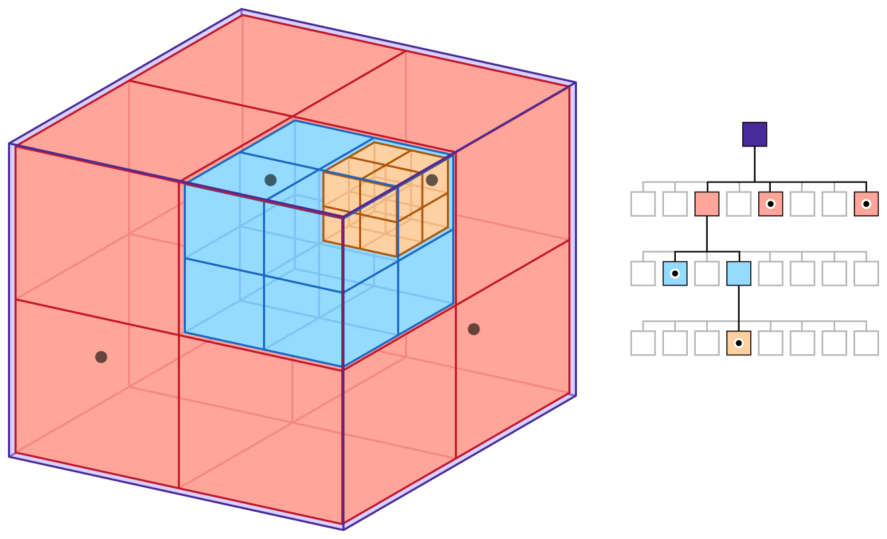
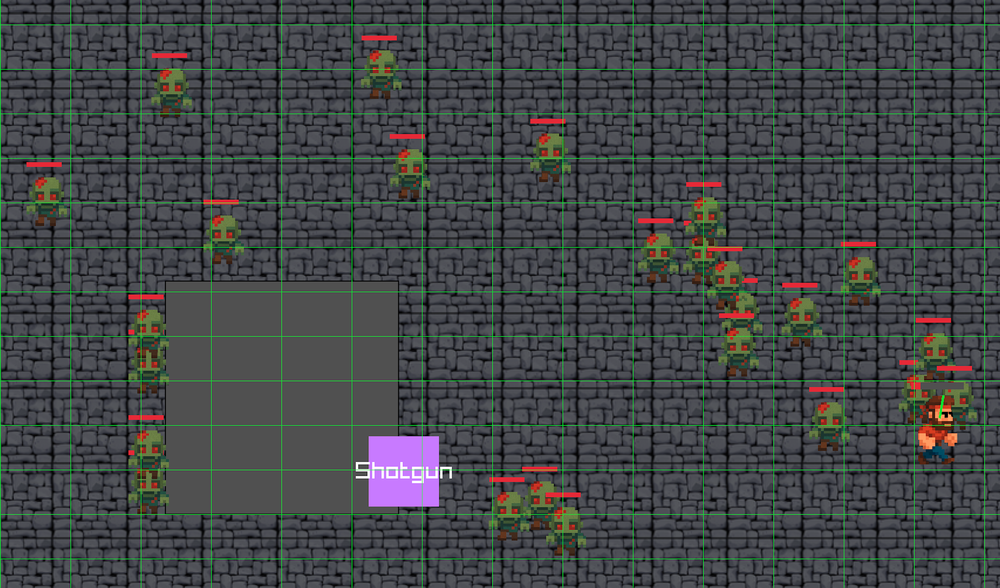
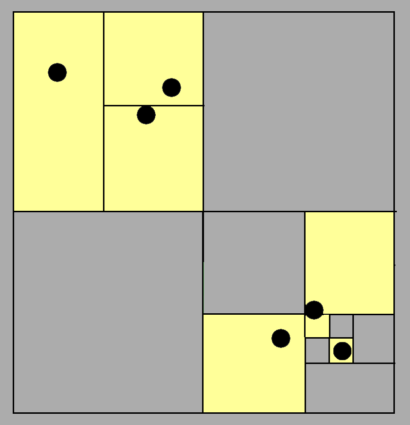
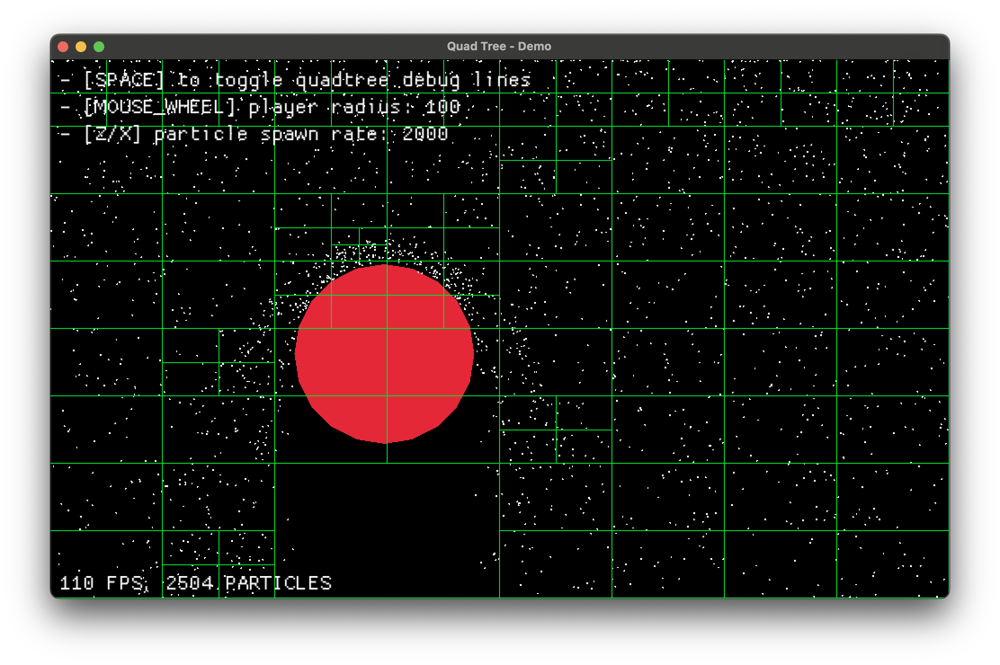

# Spatial partitioning for collision detection

When you have many objects on screen, like projectiles, particles, and characters, collision detection gets expensive fast. Brute force checks do not scale well. Spatial partitioning helps with that. In this short post, we look at 2D collision detection, common bottlenecks, and how **quadtrees** help. We will also walk through a real example using **Rust and Macroquad**.

## Talbe of contents

- [Spatial partitioning for collision detection](#spatial-partitioning-for-collision-detection)
- [Why spatial partitioning?](#why-spatial-partitioning)
- [2D collision detection](#2d-collision-detection)
- [Useful data structures](#useful-data-structures)
  - [Grids](#grids)
  - [Quadtree](#quadtree)
- [Implementing a quadtree](#implementing-a-quadtree)
  - [We'll be creating](#well-be-creating)
  - [Resources](#resources)
  - [Making regions](#making-regions)
  - [Adding points](#adding-points)
  - [Querying](#querying)
  - [Quadtree update and collision detection](#quadtree-update-and-collision-detection)
  - [Collision Detection](#collision-detection)
  - [Debug drawing](#debug-drawing)
  - [User controls implementation](#user-controls-implementation)
  - [Visualizing the quadtree structure](#visualizing-the-quadtree-structure)
  - [Tweaking parameters for performance testing](#tweaking-parameters-for-performance-testing)
  - [Displaying FPS](#displaying-fps)
- [To wrap up](#to-wrap-up)
- [Credits](#credits)


<br>

## Why spatial partitioning?

Naive collision detection checks every object against every other object. That becomes impractical quickly. If we use position data, we can skip most checks and focus only on objects that are close.

**Spatial partitioning** organizes objects in space so we do fewer unnecessary comparisons. It reduces the work needed to answer spatial queries.

> For collision detection, we only care about objects likely to collide with a target. There is no reason to check objects that are clearly far away.

<div style="text-align: center;">
  
</div>

Games, simulations, and physics engines use spatial partitioning for fast "what's near me" lookups, including:

- **Broad-phase collision detection**
- Raycasting acceleration
- Visibility checks
- Frustum culling

Side note: I highly recommend Bob Nystrom's article. I took the image above from it: [https://www.gameprogrammingpatterns.com/spatial-partition.html](https://www.gameprogrammingpatterns.com/spatial-partition.html)

<br>

## 2D collision detection

As said before, the naive way is to loop through every pair of objects and check if they collide.

```rust
for i in 0..entities.len() {
    for j in (i+1)..entities.len() {
        check_collision(&entities[i], &entities[j]);
    }
}
```

This works fine with a small number of objects. Once object count rises, it becomes a frame killer. 1,000 objects means nearly 500,000 checks every frame.

$$
\begin{aligned}
\text{Total comparisons} &= \frac{N(N + 1)}{2} \\
                         &= \frac{1000 \times 1001}{2} \\
                         &= \frac{1001000}{2} \\
                         &= 500500
\end{aligned}
$$

Entity 0 checks against [1, 2, ..., 999], Entity 1 checks against [2, ..., 999], and so on. That gives us $ 1000 + 998 + 997 + ... + 1 $ comparisons. It is the sum of the first N natural numbers, where N is the number of objects. We are dealing with $ O( n( n+1 ) / 2 )$, which becomes $ O( n^2 ) $ for large $ n $.

The major downside is that **we do not know which objects are worth checking**. We could compute every distance and run collision checks on everything, but that is very inefficient. We need a better way to query nearby objects. Ideally, we want an $ O(\log N ) $ operation that tells us who is nearby.

<br>

## Useful data structures

### Grids

Split the world into uniform, fixed-size cells, like a chessboard covering the entire space. Each object is assigned to the cell it falls into. When querying:

- look only in the object’s cell and its 8 neighbors
- if each cell holds on average k objects, you check at most 9k entries (this would also depend on what kind of bodies you're working with).

**Querying cost**  

$$
T_\text{grid} \approx 9k \quad\implies\quad O(1)\ (\text{if }k\text{ is bounded})
$$

<div style="text-align: center;">
  
</div>

> **NOTE**: Grids are fast and simple, but they don’t scale well when object densities vary a lot. Sparse regions **waste memory**.

<br>

### Quadtree

Quadtrees handle uneven density well. They split space more where objects cluster and keep it coarse where few objects exist. This moves complexity into the data structure so queries are cheaper.

**Querying cost**  
$$
T_\text{quadtree} \approx O(h + m) \approx O(\log N + m)
$$

where $ m $ is the number of reported neighbors (usually small).

> **Tree traversal**
> $$
> tree height =  h \approx \log_4 N = O(\log N)
> $$

<div style="text-align: center;">
  
</div>

<br>

---

## Implementing a quadtree

I built a small demo to show how a quadtree behaves and where it helps. The demo is a Rust + Macroquad program where a floating circle collides with falling particles. Collision resolution is simple on purpose. It uses collision direction plus a damping effect from relative velocity.

<br>

### We'll be creating

- Falling particles
- A circular rigid body following the user cursor
- Collision resolution between particle and circle using a per-frame **quadtree**
- Debug visualization of the quadtree on screen

<video controls autoplay muted preload="none" width="100%" style="margin-top: 1em;">
  <source src="https://github.com/th3terrorist/website/raw/refs/heads/main/web/assets/qt/qt-demo.mp4" type="video/mp4">
</video>

<br>

### Resources

- Installing the Rust toolchain: [https://www.rust-lang.org/learn/get-started](https://www.rust-lang.org/learn/get-started)
- Getting started with **macroquad**
    - [https://macroquad.rs/](https://macroquad.rs/)
    - [https://macroquad.rs/docs/](https://macroquad.rs/docs)
- **NOTE**: All the code I'll reference throughout this overview references the demo implementation you can find [here](https://github.com/rhighs/quadtree-demo)

The heart of this system is the `QuadNode` struct, which simply represents a node in our quadtree:

```rust
struct QuadNode {
    region: Rect,
    points: Vec<(u32, Vec2)>,
    regions: Vec<Box<QuadNode>>,
}
```

Each node contains:

- A rectangular region

- Points within that region

- Child regions as Box types

    - about `Box<T>`: [https://doc.rust-lang.org/book/ch15-01-box.html](https://doc.rust-lang.org/book/ch15-01-box.html)

When working with quadtrees you need to care about:

- Creating regions

- Adding points to a region

- Querying the quadtree

<br>

### Making regions

This part is straightforward, the code explains it better than words.

```rust
impl QuadNode {
    fn new(region: Rect) -> Self {
        Self {
            region,
            points: Vec::new(),
            regions: QuadNode::make_regions(&region),
        }
    }

    fn make_regions(region: &Rect) -> Vec<Box<QuadNode>> {
        let x = region.x;
        let y = region.y;
        let hw = region.w / 2.0;
        let hh = region.h / 2.0;
        vec![
            Box::new(QuadNode::new_empty(Rect::new(x, y, hw, hh))),
            Box::new(QuadNode::new_empty(Rect::new(x + hw, y, hw, hh))),
            Box::new(QuadNode::new_empty(Rect::new(x, y + hh, hw, hh))),
            Box::new(QuadNode::new_empty(Rect::new(x + hw, y + hh, hw, hh))),
        ]
    }
}
```

<br>

### Adding points

Adding a point is easily solved via recursion:

- We must first check if the point is contained within the current region (our recursion base case).

- If the node has no subdivisions and isn't at capacity yet, the point is simply added to the current node's point collection.

    -  If adding this point would exceed the `QUADTREE_REGION_LIMIT` capacity, the node splits into four quadrants and distributes all points plus the new one among the children based on their position.

- If the node is already subdivided, the point is passed down to the appropriate child node that contains its coordinates.

For this demo, recursion depth stays manageable. If depth becomes a problem, adjust the region limit parameter.

```rust
fn add(&mut self, id: u32, position: &Vec2) {
    if !self.region.contains(position.clone()) {
        return;
    }

    if self.regions.len() == 0 {
        if self.points.len() == QUADTREE_REGION_LIMIT {
            self.split();
            self.add(id, position);
        } else {
            self.points.push((id, position.clone()));
        }

        return;
    }

    for region in &mut self.regions {
        region.add(id, position);
    }
}
```

**NOTE**: The region limit is an important tradeoff. A higher value means fewer splits and less memory overhead, but heavier collision checks. A lower value means more tree work and more memory use, but fewer collision checks later.

<br>

### Querying

```rust
fn query(&self, query_area: &Rect) -> Vec<(u32, Vec2)> {
    let mut ids = Vec::new();
    for node in &self.regions {
        if node.in_region(query_area) {
            if node.regions.len() > 0 {
                ids.append(&mut node.query(query_area));
            } else {
                ids.append(&mut node.points.clone());
            }
        }
    }
    ids
}
```

<br>

### Quadtree update and collision detection

In the main game loop, we want rebuild the quadtree each frame:

> **NOTE**: quadtrees are not really designed for highly dynamic scenes. They fit static or slowly changing environments better.
> For this real time demo, we rebuild the quadtree every frame as objects move.

```rust
let mut qtree = QuadNode::new(Rect::new(
    0.0,
    0.0,
    WINDOW_WIDTH as f32,
    WINDOW_HEIGHT as f32,
)); // initial region = screen space

for (i, particle) in particles.iter().enumerate() {
    qtree.add(i as u32, &particle.entity.position);
}
```

<br>

### Collision Detection

I will not go deep into this part because it is straightforward and fits in about 40 lines. What we want is a way to resolve collisions with the player body. My approach was:

- Query the area the player is currently at (which is naively calculated below)

- Verify the found particles actually overlap

- Apply some sort of collision resolution

Here, collision resolution uses the circle surface normal and reflection vector to create a bounce effect.

```rust
let player_rect = Rect::new(
    player.entity.position.x - player.entity.bound.r,
    player.entity.position.y - player.entity.bound.r,
    player.entity.bound.r * 2.0,
    player.entity.bound.r * 2.0,
);

for i in qtree.query(&player_rect).iter().map(|p| p.0) {
    if particles[i as usize]
        .entity
        .bound
        .overlaps(&player.entity.bound)
    {
        let particle = &mut particles[i as usize];
        let particle_pos: Vec2 = particle.entity.bound.point();
        let player_pos: Vec2 = player.entity.bound.point();

        // normal vector for reflection
        let normal = (particle_pos - player_pos).normalize();
        let separation_distance = particle.entity.bound.r + player.entity.bound.r;
        particle.entity.position = player_pos + (normal * separation_distance);

        // get reflection vector using the normal
        // v' = v - 2(v·n)n where n is the normal and v is the velocity
        particle.velocity = (particle.velocity + player_velocity)
            - (normal * (2.0 * particle.velocity.dot(normal)));

        // dampening and min velocity
        particle.velocity = particle.velocity * 0.3;
        if particle.velocity.length() < 100.0 {
            particle.velocity = particle.velocity.normalize() * 100.0;
        }

        // small random variation for a fake natural effect
        {
            let angle_variation: f32 = rand::gen_range(-0.1, 0.1);
            // apply temp rotation matrix
            let cos_theta = angle_variation.cos();
            let sin_theta = angle_variation.sin();
            let vx = particle.velocity.x * cos_theta - particle.velocity.y * sin_theta;
            let vy = particle.velocity.x * sin_theta + particle.velocity.y * cos_theta;
            particle.velocity = Vec2::new(vx, vy);
        }
    }
}
```

You can see how this reduces the number of checks. We no longer check against every particle. We ask the quadtree for the most relevant particles that are likely to collide.

<br>

### Debug drawing

Since this is Rust, we use traits. A `DrawShape` trait is used throughout the demo so any drawable type exposes a draw function. Just like `Player`, we can implement it for `QuadNode`. We also use recursion here.

```rust
trait DrawShape {
    fn draw(self: &Self) {}
}

impl DrawShape for QuadNode {
    fn draw(&self) {
        let r = self.region;
        draw_rectangle_lines(r.x, r.y, r.w, r.h, 1.0, GREEN);
        for region in &self.regions {
            region.draw();
        }
    }
}

impl DrawShape for Player {
    fn draw(&self) {
        draw_circle(
            self.entity.position.x,
            self.entity.position.y,
            self.entity.bound.r,
            RED,
        );
    }
}

impl DrawShape for Particle {
    fn draw(&self) {
        draw_circle(
            self.entity.position.x,
            self.entity.position.y,
            self.entity.bound.r,
            WHITE,
        );
    }
}
```

<br>

### User controls implementation

The user interaction system allows for real-time modification of simulation parameters, e.g.:

```rust
// adjust player radius with mouse wheel
let (_, mouse_wheel_y) = mouse_wheel();
if mouse_wheel_y != 0.0 {
    player.entity.bound.r = (player.entity.bound.r + mouse_wheel_y * 5.0)
        .max(30.0)
        .min(300.0);
}
```

<br>

### Visualizing the quadtree structure

To better understand how the quadtree adapts to particle distribution, we can toggle a debug visualization with the space bar:

```rust
impl DrawShape for QuadNode {
    fn draw(&self) {
        let r = self.region;
        draw_rectangle_lines(r.x, r.y, r.w, r.h, 1.0, GREEN);
        for region in &self.regions {
            region.draw();
        }
    }
}

// in the draw block
if debug_lines {
    qtree.draw();
}
```

Each quadtree node is outlined in green, showing how space is partitioned dynamically.

**Quadtree visualization example:**

<div style="text-align: center; margin-top: 1em;">
  
</div>

> Green lines reveal how dense areas are subdivided further for efficient collision checks.

<br>

### Tweaking parameters for performance testing

You can tweak a few constants to study the quadtree's behavior:

```rust
const QUADTREE_REGION_LIMIT: usize = 50;   // max points before splitting
const PARTICLE_SPAWN_INTERVAL: f32 = 0.05; // time between particle spawns
const PARTICLE_SPAWN_RATE: f32 = 2000.0;   // particles per second
const PARTICLE_RADIUS: f32 = 1.0;          // particle size in pixels
```

Increasing `QUADTREE_REGION_LIMIT` means fewer splits but heavier queries. Tuning `PARTICLE_SPAWN_RATE` stresses the system with different loads.  
(Dynamic user controls would be cleaner, but I kept this static.)

<br>

### Displaying FPS

Quick and simple:

```rust
draw_text(
    format!("{} FPS", get_fps()).as_str(),
    WINDOW_WIDTH as f32 - 120.0,
    30.0,
    30.0,
    WHITE,
);
```

## To wrap up

Now that we have a rough idea of how a quadtree is used, I didn’t include the full code here since it’s a bit too long, but you can get it [here](https://raw.githubusercontent.com/th3terrorist/quadtree-demo/refs/heads/main/src/main.rs).

Alternatively, you can copy and paste the following to try the demo yourself:

```
git clone https://github.com/th3terrorist/quadtree-demo.git
cd quadtree-demo
cargo run --release
```

Efficient collision detection is mostly about removing redundant checks. Spatial partitioning shifts complexity from runtime brute force to structured queries, which gives near logarithmic lookups in the right scenarios. Thanks for reading.

---

## Credits

- **Bob Nystrom**, for his excellent article *Spatial Partitioning* in [Game Programming Patterns](https://www.gameprogrammingpatterns.com/spatial-partition.html), a major inspiration and source of great learning material and of one of the images.

- **LearnOpenGL**, for the visualizations used to illustrate grid and quadtree partitioning. Their original articles are available at [https://learnopengl.com/Guest-Articles/2021/Scene/Frustum-Culling](https://learnopengl.com/Guest-Articles/2021/Scene/Frustum-Culling).

- **Macroquad** team, for providing a clean and accessible Rust game development framework: [https://macroquad.rs/](https://macroquad.rs/).

> All external images used are credited to their original authors.  
> This article was written as an educational, non-commercial exploration of spatial partitioning techniques.
